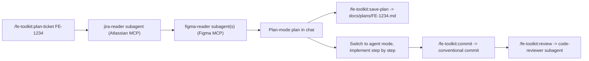

# fe-toolkit

A Claude Code plugin that wires up a complete frontend development workflow:

```
/fe-toolkit:plan-ticket FE-1234   ->  read Jira + Figma, produce a plan-mode plan
/fe-toolkit:save-plan             ->  persist the plan to docs/plans/FE-1234.md
                ... implement ...
/fe-toolkit:review                ->  FE-focused diff review (a11y / perf / types / tests)
/fe-toolkit:commit                ->  draft a Conventional Commits v1.0.0 message
```

It bundles:

- The **Atlassian Rovo MCP** inline (Streamable HTTP), so Jira/Confluence reads work out of the box with one OAuth.
- The official **Figma plugin** as a dependency, so Figma reads (and Figma's own skills) come along for free with one OAuth.
- Subagents: `jira-reader`, `figma-reader`, `code-reviewer`.
- Skills: `conventional-commit`, `save-plan`.

## Install

You need Claude Code 2.1+ with plugin support.

### Quick install (recommended)

Add this repo as a single-plugin marketplace, then install:

```bash
claude plugin marketplace add <git-url-of-this-repo>
claude plugin install fe-toolkit@<marketplace-name>
```

The marketplace name is whatever you (or Claude Code) registered the source under - check with `claude plugin marketplace list` after `add`.

### Local development install

Clone this repo, then from its parent directory:

```bash
claude plugin install ./fe-toolkit-demo
```

This treats the folder as a single-plugin marketplace and copies it into `~/.claude/plugins/cache`. Re-run after manifest changes.

### What gets installed transitively

When the plugin is enabled, Claude Code will:

1. Pull in the official Figma plugin (`figma@claude-plugins-official`) as a dependency. This gives you the `figma` MCP server plus Figma's bundled skills (`figma-use`, `figma-generate-design`, `figma-code-connect`, etc.).
2. Start the inline Atlassian MCP server (`atlassian`) pointing at `https://mcp.atlassian.com/v1/mcp/authv2`.

Verify with:

```bash
claude plugin list
/mcp        # in a Claude Code session - should list `atlassian` and `figma`
/plugin     # should show fe-toolkit enabled with 4 commands, 3 agents, 2 skills, 1 MCP server
```

## First-run auth

Both MCPs use OAuth 2.1; nothing is hardcoded. On first use:

- The first Atlassian tool call (any `/fe-toolkit:plan-ticket FE-1234`) opens a browser tab to authorize your Atlassian Cloud site (Jira / Confluence / Compass).
- The first Figma tool call opens a browser tab to authorize Figma.

After that, tokens persist; subsequent runs need no interaction.

If a browser does not open, run the corresponding command and watch the terminal for the authorization URL to copy/paste.

## Usage loop



### `/fe-toolkit:plan-ticket <TICKET-ID>`

Reads the Jira ticket, follows every Figma URL in the description / comments, scouts the repo, then produces a plan-mode development plan with: Context, Design notes, Scope, Affected files, Implementation steps, Testing strategy, Risks & open questions. Ends by asking you to **Accept / Revise / Save**.

### `/fe-toolkit:save-plan [TICKET-ID]`

Writes the most recent plan to `docs/plans/<TICKET-ID>.md` using a consistent template. Asks before overwriting existing plan files.

### `/fe-toolkit:review [base-branch]`

Diffs the current branch against `origin/main` (or the ref you pass) and dispatches the `code-reviewer` subagent, which returns a Blocking / Suggestions / Nits review with concrete `path:line` citations. Read-only - no auto-fixes.

### `/fe-toolkit:commit [hint]`

Drafts a [Conventional Commits v1.0.0](https://www.conventionalcommits.org/en/v1.0.0/) message based on what is actually staged (or asks before staging more), shows it to you, then commits. Refuses `--no-verify`, refuses to commit obvious secret files, and never amends pushed commits.

## Repo layout

```
fe-toolkit-demo/
├── .claude-plugin/
│   └── plugin.json
├── .mcp.json                       # Atlassian Rovo (Streamable HTTP)
├── commands/
│   ├── plan-ticket.md              # /fe-toolkit:plan-ticket
│   ├── save-plan.md                # /fe-toolkit:save-plan
│   ├── commit.md                   # /fe-toolkit:commit
│   └── review.md                   # /fe-toolkit:review
├── agents/
│   ├── jira-reader.md
│   ├── figma-reader.md
│   └── code-reviewer.md
├── skills/
│   ├── conventional-commit/
│   │   ├── SKILL.md
│   │   ├── reference.md            # condensed spec
│   │   └── scripts/commit.sh
│   └── save-plan/
│       └── SKILL.md
└── README.md
```

## Troubleshooting

| Symptom | Fix |
|---------|-----|
| `/mcp` does not list `atlassian` | Run `/reload-plugins` after a manifest change. Check `claude --debug` for MCP init errors. |
| `/mcp` does not list `figma` | Confirm the Figma plugin dependency installed: `claude plugin list`. If missing, run `claude plugin install figma@claude-plugins-official` manually. |
| Atlassian tool call hangs | Browser OAuth was not completed. Re-run the command and click through the authorization tab. |
| Jira ticket "not found" | Confirm the cloudId your account has access to actually contains the project. The `jira-reader` subagent guesses one if multiple sites are linked - check its `Notes` section. |
| Commit subject "too long" error | The `conventional-commit` skill caps subjects at 72 chars. Shorten or move detail into the body. |
| `/fe-toolkit:plan-ticket` says "ticket key invalid" | Use the canonical form `[A-Z][A-Z0-9]+-\d+`, e.g. `FE-1234`, `WEB-12`. URLs are not accepted directly. |

## Dependencies

- Claude Code 2.1+ (plugin format and HTTP MCP transport).
- Atlassian Cloud site with Jira and/or Confluence enabled.
- A Figma account with access to the files you plan to reference.
- A modern browser for OAuth flows.

## Versioning

This plugin uses semver. See [.claude-plugin/plugin.json](.claude-plugin/plugin.json) for the current version. Changelog will live in `CHANGELOG.md` once we cut a 0.2 release.
