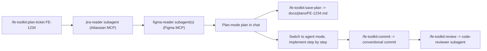

# fe-toolkit

A Claude Code plugin that wires up a complete frontend development workflow:

```
/fe-toolkit:plan-ticket FE-1234   ->  read Jira + Figma, produce a plan-mode plan
/fe-toolkit:save-plan             ->  persist the plan to docs/plans/FE-1234.md
                ... implement ...
/fe-toolkit:review                ->  FE-focused diff review (a11y / perf / types / tests)
/fe-toolkit:commit                ->  draft a Conventional Commits v1.0.0 message
```

It bundles:

- The **Atlassian Rovo MCP** inline (Streamable HTTP), so Jira/Confluence reads work out of the box with one OAuth.
- The official **Figma plugin** as a dependency, so Figma reads (and Figma's own skills) come along for free with one OAuth.
- Subagents: `jira-reader`, `figma-reader`, `code-reviewer`.
- Skills: `conventional-commit`, `save-plan`.

## Install

You need Claude Code 2.1+ with plugin support.

### Quick install (recommended)

Add this repo as the `tubi-fe` marketplace, then install the plugin:

```bash
claude plugin marketplace add https://github.com/nickqi-tubi/fe-toolkit-demo
claude plugin install fe-toolkit@tubi-fe
```

The marketplace name (`tubi-fe`) and plugin name (`fe-toolkit`) are declared in [`.claude-plugin/marketplace.json`](.claude-plugin/marketplace.json) and [`.claude-plugin/plugin.json`](.claude-plugin/plugin.json) respectively. Verify with `claude plugin marketplace list` after `add`.

### Local development install

For iterating on the plugin itself (so you don't have to push to GitHub between every edit), register the local clone as a marketplace and install from it:

```bash
git clone https://github.com/nickqi-tubi/fe-toolkit-demo.git
claude plugin marketplace add ./fe-toolkit-demo
claude plugin install fe-toolkit@tubi-fe
```

Note: `claude plugin install` always takes a `<name>@<marketplace>` reference, never a directory path - the `marketplace add` step is what registers the directory. The marketplace name (`tubi-fe`) comes from the `name` field in [`.claude-plugin/marketplace.json`](.claude-plugin/marketplace.json).

If you already added the GitHub copy of this marketplace, you'll hit a name collision because both declare themselves as `tubi-fe`. Pick one:

```bash
# Option A: switch to the local copy
claude plugin marketplace remove tubi-fe
claude plugin marketplace add ./fe-toolkit-demo
claude plugin install fe-toolkit@tubi-fe

# Option B: keep the GitHub copy, refresh after each push
git push                                # publish your local edits
claude plugin marketplace update tubi-fe
claude plugin update fe-toolkit@tubi-fe
```

After edits to commands, agents, or skills you can pick them up without reinstalling by running `/reload-plugins` inside a Claude Code session. Changes to `.mcp.json` or `plugin.json` itself need a session restart.

### What gets installed transitively

When the plugin is enabled, Claude Code will:

1. Pull in the official Figma plugin (`figma@claude-plugins-official`) as a dependency. This gives you the `figma` MCP server plus Figma's bundled skills (`figma-use`, `figma-generate-design`, `figma-code-connect`, etc.).
2. Start the inline Atlassian MCP server (`atlassian`) pointing at `https://mcp.atlassian.com/v1/mcp/authv2`.

Verify with:

```bash
claude plugin list
/mcp        # in a Claude Code session - should list `atlassian` and `figma`
/plugin     # should show fe-toolkit enabled with 5 commands, 3 agents, 2 skills, 1 MCP server, 1 hook
```

## First-run auth

Both MCPs use OAuth 2.1; nothing is hardcoded. The recommended way to complete both flows in one shot is:

```text
/fe-toolkit:auth
```

That command checks each MCP server, opens a browser tab for any one that needs authentication (Atlassian, then Figma), and verifies the resulting token works. Run it once after install.

### Why not just let it auto-trigger?

Each MCP server's OAuth token is shared across all of Claude Code (it lives in your system keychain under `Claude Code-credentials`), so the very first time you use any tool that needs Atlassian or Figma OAuth, a browser tab opens automatically and the token persists from then on. In practice, though:

- If you have used Atlassian Cloud from another Claude Code plugin before, that token is already cached and Atlassian shows `✓ Connected` from day one - no browser needed.
- The Figma MCP is newer, so most users hit `! Needs authentication` the first time. Subagents are not guaranteed to bubble the OAuth flow up to a browser tab in your terminal session, so the call can fail silently with a "permissions issue" error instead of opening the browser. Running `/fe-toolkit:auth` from the top-level agent avoids that path entirely.

A `SessionStart` hook detects this state on every Claude Code launch and prints a one-line reminder if any MCP server tied to this plugin is still `Needs authentication`. The reminder points you straight at `/fe-toolkit:auth`.

### Manual fallback

If `/fe-toolkit:auth` does not work for some reason, you can complete OAuth via Claude Code's built-in MCP UI:

```text
/mcp
```

then arrow-key to the row that says `Needs authentication` and press Enter. Same flow, just one extra step.

Once both servers show `✓ Connected` in `claude mcp list`, tokens persist across sessions until they expire (months, typically) - subsequent runs need no interaction.

## Usage loop



### `/fe-toolkit:auth`

One-shot OAuth into every MCP server this plugin needs (Atlassian + Figma). Idempotent - if a server is already authenticated it is left alone. Run once after install, and any time `claude mcp list` shows a `Needs authentication` row for a plugin-provided server.

### `/fe-toolkit:plan-ticket <TICKET-ID>`

Reads the Jira ticket, follows every Figma URL in the description / comments, scouts the repo, then produces a plan-mode development plan with: Context, Design notes, Scope, Affected files, Implementation steps, Testing strategy, Risks & open questions. Ends by asking you to **Accept / Revise / Save**. Performs a pre-flight check that both MCPs are authenticated; if not, it stops with a pointer to `/fe-toolkit:auth` instead of failing inside a subagent.

### `/fe-toolkit:save-plan [TICKET-ID]`

Writes the most recent plan to `docs/plans/<TICKET-ID>.md` using a consistent template. Asks before overwriting existing plan files.

### `/fe-toolkit:review [base-branch]`

Diffs the current branch against `origin/main` (or the ref you pass) and dispatches the `code-reviewer` subagent, which returns a Blocking / Suggestions / Nits review with concrete `path:line` citations. Read-only - no auto-fixes.

### `/fe-toolkit:commit [hint]`

Drafts a [Conventional Commits v1.0.0](https://www.conventionalcommits.org/en/v1.0.0/) message based on what is actually staged (or asks before staging more), shows it to you, then commits. Refuses `--no-verify`, refuses to commit obvious secret files, and never amends pushed commits.

## Repo layout

```
fe-toolkit-demo/
├── .claude-plugin/
│   ├── plugin.json                 # plugin manifest (this plugin)
│   └── marketplace.json            # marketplace catalog (publishes this plugin as tubi-fe)
├── .mcp.json                       # Atlassian Rovo (Streamable HTTP)
├── commands/
│   ├── plan-ticket.md              # /fe-toolkit:plan-ticket
│   ├── save-plan.md                # /fe-toolkit:save-plan
│   ├── commit.md                   # /fe-toolkit:commit
│   ├── review.md                   # /fe-toolkit:review
│   └── auth.md                     # /fe-toolkit:auth
├── agents/
│   ├── jira-reader.md
│   ├── figma-reader.md
│   └── code-reviewer.md
├── skills/
│   ├── conventional-commit/
│   │   ├── SKILL.md
│   │   ├── reference.md            # condensed spec
│   │   └── scripts/commit.sh
│   └── save-plan/
│       └── SKILL.md
├── hooks/
│   └── hooks.json                  # SessionStart -> scripts/check-auth.sh
├── scripts/
│   └── check-auth.sh               # warns if any plugin MCP needs OAuth
└── README.md
```

## Troubleshooting

| Symptom | Fix |
|---------|-----|
| `/mcp` does not list `atlassian` | Run `/reload-plugins` after a manifest change. Check `claude --debug` for MCP init errors. |
| `/mcp` does not list `figma` | Confirm the Figma plugin dependency installed: `claude plugin list`. If missing, run `claude plugin install figma@claude-plugins-official` manually. |
| Atlassian tool call hangs | Browser OAuth was not completed. Re-run the command and click through the authorization tab. |
| Jira ticket "not found" | Confirm the cloudId your account has access to actually contains the project. The `jira-reader` subagent guesses one if multiple sites are linked - check its `Notes` section. |
| Commit subject "too long" error | The `conventional-commit` skill caps subjects at 72 chars. Shorten or move detail into the body. |
| `/fe-toolkit:plan-ticket` says "ticket key invalid" | Use the canonical form `[A-Z][A-Z0-9]+-\d+`, e.g. `FE-1234`, `WEB-12`. URLs are not accepted directly. |
| `claude plugin marketplace add` errors with `Marketplace file not found at .../.claude-plugin/marketplace.json` | The repo on GitHub does not yet contain the marketplace catalog. Pull `main`, confirm `.claude-plugin/marketplace.json` exists, push, and retry. |
| `claude plugin install ./fe-toolkit-demo` errors with `Plugin "./fe-toolkit-demo" not found in any configured marketplace` | `claude plugin install` only accepts `<name>@<marketplace>`, not a directory path. Run `claude plugin marketplace add ./fe-toolkit-demo` first, then `claude plugin install fe-toolkit@tubi-fe`. |
| `marketplace add` fails because `tubi-fe` already exists | You previously added the GitHub copy. Run `claude plugin marketplace remove tubi-fe` and re-add either source. |
| `fe-toolkit` shows `failed to load` with `Dependency "figma@tubi-fe" is not installed` | The plugin's manifest must spell the dependency's marketplace correctly (`{ "name": "figma", "marketplace": "claude-plugins-official" }`) AND the `tubi-fe` marketplace must opt in to cross-marketplace dependencies via `"allowCrossMarketplaceDependenciesOn": ["claude-plugins-official"]`. Both are already in this repo; if you see the error, you're on an old install. Fix with: `claude plugin marketplace update tubi-fe && claude plugin update fe-toolkit@tubi-fe`. As a one-time fallback, you can install Figma manually first: `claude plugin install figma@claude-plugins-official`. |

## Dependencies

- Claude Code 2.1+ (plugin format and HTTP MCP transport).
- Atlassian Cloud site with Jira and/or Confluence enabled.
- A Figma account with access to the files you plan to reference.
- A modern browser for OAuth flows.

## Versioning

This plugin uses semver. See [.claude-plugin/plugin.json](.claude-plugin/plugin.json) for the current version. Changelog will live in `CHANGELOG.md` once we cut a 0.2 release.
